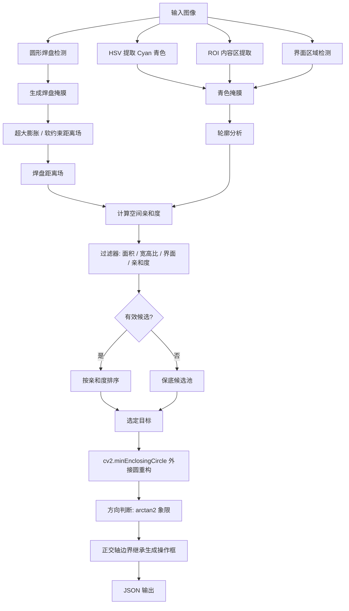

<h1 align='center'>CAM 异常检测系统优化报告</h1>

## 目录

- [一、项目背景](#一项目背景)
- [二、原版本存在的致命缺陷](#二原版本存在的致命缺陷)
- [三、优化方案总览](#三优化方案总览)
- [四、详细优化内容](#四详细优化内容)
- [五、技术实现细节](#五技术实现细节)
- [六、效果对比](#六效果对比)
- [七、API 输出变更](#七api-输出变更)
- [八、部署与使用](#八部署与使用)
- [九、总结](#九总结)

---

## 一、项目背景

本系统用于检测 Genesis 2000 CAM 软件截图中的青色（Cyan）DRC 异常标记，并输出用于设备干涉的操作框坐标。系统采用传统机器视觉技术（OpenCV），通过 HSV 色彩空间分割、形态学操作、轮廓分析等方法实现异常定位。

### 应用场景

- Genesis CAM 阶段 DRC 检查自动化
- 焊盘异常定位（短路、开路、间距不足等）
- 为后续设备 API 提供精确的操作框坐标（`coor1` / `coor2`）

---

## 二、原版本存在的致命缺陷

### 缺陷 1：红蓝掩膜布尔逻辑死锁（最严重）

**背景**：

原代码通过 `get_target_pad_mask()` 提取红色焊盘区域，并用 `cv2.bitwise_and` 将其与蓝色掩膜做硬相交，试图把"蓝色异常"限制在焊盘范围内。

```python
# origin.py — 致命逻辑
blue_mask = cv2.bitwise_and(blue_mask, target_pad_mask)
```

**根本矛盾**：

在 Genesis 的 2D 渲染中，青色 DRC 标记在视觉上**直接覆盖并遮挡**其下方的红色铜层。这意味着：

- 青色区域在图像中显示为**青色像素**
- 同一位置的红色铜层像素**已被替换**，不存在于图像中
- `target_pad_mask` 在青色标记所在处恰好出现**黑洞（零值）**

对两个掩膜做 `AND` 运算，其结果是将真正的检测目标抹除：

```
蓝色掩膜 (blue_mask):     焊盘掩膜 (target_pad_mask):   AND 结果:
  0 0 1 1 0                  0 0 0 0 0                  0 0 0 0 0
  0 1 1 1 0     AND           0 0 0 0 0        =         0 0 0 0 0
  0 0 1 1 0                  0 0 0 0 0                  0 0 0 0 0
      ↑                           ↑                          ↑
  青色目标           青色遮挡形成的黑洞              目标被完全抹除
```

**实际影响**：正常情况下应当产生高置信度检测结果的图像，因为青色像素与焊盘掩膜的黑洞完全重合，导致所有有效候选轮廓被过滤，系统退化为"保底输出"或"默认区域"。

---

### 缺陷 2：坐标轴塌陷（几何降维打击）

**背景**：

原代码在生成 2.5 倍扩展坐标时，将"非扩展轴"的两个端点设为同一个中心值：

```python
# origin.py — 垂直方向时，X 轴两端点相同
p1_x = (min_x + max_x) // 2   # ← 中点
p1_y = max(0, min_y - expansion)
p2_x = (min_x + max_x) // 2   # ← 同一个中点
p2_y = min(h - 1, max_y + expansion)
```

**实际影响**：

输出的矩形框 `coor1(x, y1)` → `coor2(x, y2)` 中 x 坐标完全相同，描述的是一条**零宽度的线段**而非具有面积的矩形。后续设备 API 或宏调用在接收到此类退化几何体时，轻则输出错误，重则直接崩溃。

```
期望输出 (具有面积的矩形):     实际输出 (零宽度线段):
  coor1(280, 120)              coor1(300, 120)
       ┌─────┐                       |
       │     │          →            |
       │     │                       |
       └─────┘                       |
  coor2(320, 480)              coor2(300, 480)
```

---

### 缺陷 3：蓝色 HSV 阈值泛化导致误检与漏检

**背景**：

原代码使用通用"蓝色"阈值，未针对 Genesis 特有的纯青色（Cyan）进行专项调优：

```python
# origin.py — 通用蓝色阈值，未区分青色
lower_blue1 = np.array([100, 80, 80])
upper_blue1 = np.array([130, 255, 255])
lower_blue2 = np.array([90, 60, 60])
upper_blue2 = np.array([110, 255, 255])
```

**实际影响**：
- Genesis 截图经过压缩后，青色 DRC 标记的饱和度（S）和亮度（V）会发生衰减，标准蓝色阈值无法覆盖衰减后的像素范围
- 同时，原代码基于残缺像素块的原生 Bounding Box 计算几何属性，当 DRC 标记被黑色间距"腰斩"后，碎片的重心和比例严重失真

---

### 缺陷 4：坐标输出方向硬编码

**背景**：

原代码在引入方向判断前，永远只输出横向扩展结果。引入方向判断后，原版本已尝试修复此问题，但受制于缺陷 2，仍然输出退化线段。

---

### 缺陷 5：多异常时选择策略不合理

原代码在多候选场景下，使用"选择 Y 坐标最大（最靠下）"的启发式规则，与焊盘结构完全脱耦，误选率高。

---

## 三、优化方案总览

### 核心优化策略

```
┌────────────────────────────────────────────────────────────┐
│  软约束替代硬相交 + 外接圆重构 + 正交轴边界继承 + Cyan 专项调优  │
└────────────────────────────────────────────────────────────┘
                              │
       ┌──────────────────────┼──────────────────────┐
       ▼                      ▼                      ▼
  Task 1: 废除 AND         Task 2: 正交轴          Task 3: 外接圆
  改用距离场软约束         边界继承机制             重构 + Cyan 阈值
```

### 优化架构图



---

## 四、详细优化内容

### Task 1：彻底重构红蓝掩膜约束逻辑（解决布尔逻辑死锁）

#### 1.1 废除硬相交

移除原代码中对真实目标具有致命破坏性的 `bitwise_and` 操作：

```python
# origin.py — 已废除
blue_mask = cv2.bitwise_and(blue_mask, target_pad_mask)
```

青色掩膜现在独立提取，**不再与焊盘掩膜做直接相交过滤**：

```python
# main.py — 新流程：青色掩膜仅受 ROI 和界面区约束
cyan_mask = build_hsv_mask(hsv, config.cyan_hsv_ranges)
cyan_mask = cv2.bitwise_and(cyan_mask, roi_mask)
cyan_mask = cv2.bitwise_and(cyan_mask, cv2.bitwise_not(interface_mask))
```

#### 1.2 引入"软约束"空间亲和度距离场

焊盘掩膜改为参与**空间距离计算**，而非直接用于像素级过滤：

**步骤 1**：对焊盘掩膜进行超大尺寸膨胀，弥合青色遮挡形成的黑洞：

```python
# main.py — build_soft_pad_mask()
def build_soft_pad_mask(target_pad_mask, config):
    """对焊盘掩膜做超大膨胀，主动弥合青色 DRC 标记遮挡形成的黑洞。"""
    dilate_kernel = build_kernel(config.pad_soft_dilate_kernel_size)  # 25×25
    return cv2.dilate(target_pad_mask, dilate_kernel, iterations=config.pad_soft_dilate_iterations)
```

**步骤 2**：基于膨胀后的焊盘掩膜生成距离场，对每个轮廓中心计算"距焊盘最近非零像素的欧氏距离"：

```python
# main.py — 距离场计算
if np.count_nonzero(soft_pad_mask) > 0:
    pad_distance_map = cv2.distanceTransform(
        cv2.bitwise_not(soft_pad_mask), cv2.DIST_L2, 5
    )
else:
    pad_distance_map = np.full((h, w), np.inf, dtype=np.float32)
```

**步骤 3**：将距离与自适应阈值比较，得到"空间亲和度"标志，作为过滤条件之一：

```python
# main.py — 逐轮廓亲和度判定
pad_distance = float(pad_distance_map[center_y, center_x])
pad_distance_limit = max(config.pad_affinity_min_pixels,
                         circle_radius * config.pad_affinity_radius_ratio)
pad_affinity_passed = pad_distance <= pad_distance_limit
```

**新旧流程对比**：

| 环节 | origin.py（旧） | main.py（新） |
|:---:|:---:|:---:|
| 焊盘掩膜用途 | 与青色掩膜做 `AND` 硬过滤 | 仅用于生成距离场，作为软约束 |
| 青色目标是否会被掩膜黑洞消除 | ✅ 会（致命缺陷） | ❌ 不会 |
| 约束方式 | 像素级布尔运算 | 轮廓中心欧氏距离阈值 |
| 黑洞弥合 | 无 | 25×25 超大膨胀核 |

---

### Task 2：修复坐标轴塌陷（正交轴边界继承机制）

#### 2.1 问题根源

原代码在判定扩展方向后，将"副轴"（不做 2.5 倍扩展的轴）的两端均设为同一中心值，导致输出零面积线段：

```python
# origin.py — 以垂直扩展为例，X 轴两端相同
p1_x = (min_x + max_x) // 2
p1_y = max(0, min_y - expansion)
p2_x = (min_x + max_x) // 2   # ← 与 p1_x 相同 → 零宽度
p2_y = min(h - 1, max_y + expansion)
```

#### 2.2 正交轴边界继承机制

新代码明确区分"主轴"（做 2.5 倍外推）和"副轴"（继承原始轮廓边界 + Padding），保证操作框始终具有 2D 面积：

```python
# main.py — build_operation_rectangle()
def build_operation_rectangle(candidate, direction, img_shape, config):
    """
    主轴：基于重构圆直径做 2.5 倍外推
    副轴：继承原始残缺轮廓的 min/max 边界并追加 padding
    """
    cx, cy = candidate["circle_center"]
    radius  = candidate["circle_radius"]
    min_x, max_x, min_y, max_y = candidate["contour_bounds"]

    native_diameter  = max(2.0 * radius, float(config.minimum_box_side_pixels))
    expanded_diameter = native_diameter * config.operation_box_expand_ratio  # × 2.5
    half_major_axis  = expanded_diameter / 2.0
    padding = config.operation_box_padding_pixels  # 默认 4px

    if direction == "horizontal":
        # 主轴 X：以重构圆心为基准 × 2.5 外推
        x1 = cx - half_major_axis
        x2 = cx + half_major_axis
        # 副轴 Y：继承原始轮廓上下边界并加 padding
        y1 = min_y - padding
        y2 = max_y + padding
    else:  # vertical
        # 副轴 X：继承原始轮廓左右边界并加 padding
        x1 = min_x - padding
        x2 = max_x + padding
        # 主轴 Y：以重构圆心为基准 × 2.5 外推
        y1 = cy - half_major_axis
        y2 = cy + half_major_axis

    return clamp_rectangle(x1, y1, x2, y2, img_shape, config)
```

**效果对比**：

| 方向 | origin.py 输出 | main.py 输出 | 几何有效性 |
|:---:|:---:|:---:|:---:|
| horizontal | `coor1(120, 350)` → `coor2(480, 350)` | `coor1(120, 346)` → `coor2(480, 358)` | ❌ 线段 → ✅ 矩形 |
| vertical | `coor1(300, 120)` → `coor2(300, 520)` | `coor1(286, 120)` → `coor2(314, 520)` | ❌ 线段 → ✅ 矩形 |

---

### Task 3：引入外接圆重构与 Cyan 专项 HSV 调优

#### 3.1 Cyan 专项 HSV 阈值

将通用"蓝色"阈值替换为针对 Genesis 纯青色的专项范围，放宽 S/V 下限以捕获压缩衰减的像素：

```python
# origin.py — 通用蓝色（无法准确覆盖 Genesis Cyan）
lower_blue1 = np.array([100, 80, 80])
upper_blue1 = np.array([130, 255, 255])
lower_blue2 = np.array([90, 60, 60])
upper_blue2 = np.array([110, 255, 255])
```

```python
# main.py — Genesis Cyan 专项阈值（DetectorConfig）
cyan_hsv_ranges: tuple = (
    ((78, 50, 50),  (98,  255, 255)),   # 标准青色（H:78~98，S/V 下限 50）
    ((90, 40, 40),  (110, 255, 255)),   # 宽容青色（覆盖压缩衰减）
)
```

主要改动：
- H 通道精确锁定青色区间（78~110），排除偏蓝或偏绿的干扰色
- S/V 下限从 60/60 降低至 40/40，覆盖因截图压缩导致饱和度和亮度下降的像素

#### 3.2 基于最小外接圆重构残缺 DRC 标记

Genesis DRC 标记经常被黑色间距"腰斩"为多段残缺碎片，直接使用碎片的 Bounding Box 会导致重心和尺寸严重失真。

**新机制**：对每个候选轮廓强制拟合最小外接圆，以**理想圆的圆心和半径**作为后续所有计算的基准：

```python
# main.py — 外接圆重构（位于逐轮廓分析循环中）
(circle_cx, circle_cy), circle_radius = cv2.minEnclosingCircle(contour)
circle_radius = max(float(circle_radius), config.min_reconstructed_radius_pixels)
center_x = int(np.clip(round(circle_cx), 0, w - 1))
center_y = int(np.clip(round(circle_cy), 0, h - 1))
```

**外接圆的作用链**：

```
残缺青色轮廓
      │
      ▼
cv2.minEnclosingCircle(contour)
      │ 得到理想圆 (cx, cy, r)
      ├──→ 距离场查询坐标：pad_distance_map[cy, cx]
      ├──→ 焊盘距离计算：dist(圆心, 焊盘中心)
      ├──→ 方向判断：arctan2(dy, dx) 基于圆心
      └──→ 操作框生成：以 2r 为原始直径 × 2.5 外推（替代残缺 Bounding Box）
```

**对比**：

| 属性 | origin.py（残缺 BBox） | main.py（外接圆重构） |
|:---:|:---:|:---:|
| 重心位置 | 残缺碎片几何中心，偏离真实 | 完整标记的理想圆心 |
| 尺寸参考 | 碎片的 `w_box × h_box` | 外接圆直径 `2r` |
| 方向判断基准 | 碎片重心 | 理想圆心 |
| 操作框主轴长度 | 残缺片段宽/高 × 2.5 | 完整圆直径 × 2.5 |

调试模式下，重构圆会以**青色圆圈**绘制在 `_contours_debug.jpg` 上，可直观验证重构效果。

---

### 其他优化：集中配置管理（DetectorConfig）

将原代码中散落在各处的硬编码魔法数字，统一迁移至冻结数据类 `DetectorConfig`，便于实验和复现：

```python
# main.py — 集中参数管理（节选）
@dataclass(frozen=True)
class DetectorConfig:
    # 焊盘软约束
    pad_soft_dilate_kernel_size: int = 25      # 黑洞弥合核尺寸
    pad_affinity_radius_ratio: float = 0.90   # 亲和度半径比例
    pad_affinity_min_pixels: float = 8.0      # 亲和度最小距离（像素）

    # Cyan 形态学
    cyan_open_kernel_size: int = 3
    cyan_close_kernel_size: int = 5

    # 操作框生成
    operation_box_expand_ratio: float = 2.5   # 2.5 倍外推
    operation_box_padding_pixels: int = 4     # 副轴 Padding
    minimum_box_side_pixels: int = 4          # 最小边长保障

    # 外接圆
    min_reconstructed_radius_pixels: float = 3.0

    # 保底参数
    fallback_width_ratio: float = 0.20
    fallback_height_ratio: float = 0.12
```

---

### 其他优化：应急兜底与异常隔离

新版增加了两级保底机制，确保自动化链路不因单张图像异常而中断：

```python
# main.py — 顶层异常隔离
def extract_blue_regions_x_range(image_path, output_dir=None, debug=False, config=CONFIG):
    try:
        return _extract_blue_regions_x_range_impl(...)
    except Exception as error:
        # 管道异常时，返回具备 2D 面积的应急矩形，而非 None
        return build_exception_fallback_result(...)
```

- **Fallback 候选池**：所有候选均未通过过滤时，从候选池中按亲和度排序选出最优候选
- **默认区域**：候选池也为空时，在 ROI 中心输出具备明确 2D 面积的默认矩形
- **应急兜底**：整个检测管道抛出未捕获异常时，仍然输出有效 JSON，不返回 `None`

---

## 五、技术实现细节

### 5.1 方向判断数学原理

```python
# main.py — determine_anomaly_direction()
dx = anomaly_cx - pad_cx
dy = anomaly_cy - pad_cy
angle_deg = np.degrees(np.arctan2(dy, dx))
abs_angle  = abs(angle_deg)

if abs_angle < 45 or abs_angle > 135:
    return "vertical"   # 左右侧 → 主轴 Y 扩展
return "horizontal"     # 上下侧 → 主轴 X 扩展
```

**象限划分图**：

```
             上侧 (-135° ~ -45°)
             → horizontal（X 轴扩展）
                    │
左侧 ←──── (−180°/180°) ───→ 右侧
vertical              0°          vertical
（Y 轴扩展）           │          （Y 轴扩展）
                    下侧 (45° ~ 135°)
                    → horizontal（X 轴扩展）
```

**角度与方向映射表**：

| 角度范围 | 象限 | 方向输出 | 主轴 |
|:-------:|:---:|:-------:|:---:|
| -45° ~ 45° | 右侧 | `vertical` | Y 轴 × 2.5 |
| 45° ~ 135° | 下侧 | `horizontal` | X 轴 × 2.5 |
| 135° ~ 180° 或 -180° ~ -135° | 左侧 | `vertical` | Y 轴 × 2.5 |
| -135° ~ -45° | 上侧 | `horizontal` | X 轴 × 2.5 |

---

### 5.2 空间亲和度计算流程

```
1. get_target_pad_mask()   → 提取与焊盘圆相连的红色连通域
2. build_soft_pad_mask()   → 超大膨胀（25×25）弥合青色遮挡黑洞
3. cv2.distanceTransform() → 生成逐像素到焊盘掩膜的距离场
4. pad_distance_map[cy,cx] → 读取候选轮廓外接圆圆心处的距离值
5. 与阈值比较:
      limit = max(8px, radius × 0.90)
      pad_affinity_passed = (pad_distance <= limit)
```

**候选排序键**（升序，越小越优先）：

```python
# main.py — build_candidate_rank()
(
    pad_distance,           # 焊盘距离（越近越好）
    distance_to_structure,  # 圆形结构距离（越近越好）
    -circle_radius,         # 半径（越大越好，取负）
    -area,                  # 面积（越大越好，取负）
)
```

---

### 5.3 焊盘掩膜提取算法

```
1. HSV 双阈值提取所有红色像素（焊盘 + 走线）
2. 形态学闭运算填充红色区域内部小孔
3. connectedComponentsWithStats 标记所有红色连通域
4. 遍历 circular_centers（检测到的焊盘圆）：
   a. 在圆心坐标处查询连通域 ID
   b. 若圆心落在空洞（label == 0），以 1.6 倍半径探测圆查找最近连通域
   c. 将匹配到的连通域 ID 加入有效集合
5. 只保留有效集合内的连通域像素，生成 target_pad_mask
6. 超大膨胀（25×25）→ soft_pad_mask（弥合黑洞，供距离场使用）
```

---

### 5.4 保底区域最小面积保障

所有保底矩形输出均通过 `clamp_rectangle()` 保证最小边长（`minimum_box_side_pixels = 4`），防止退化为点或线：

```python
# main.py — clamp_rectangle()
if x2 - x1 < min_side:
    center_x = (x1 + x2) / 2.0
    x1 = int(np.clip(np.floor(center_x - min_side / 2.0), 0, w - 1))
    x2 = int(np.clip(np.ceil (center_x + min_side / 2.0), 0, w - 1))
# Y 轴同理
```

---

## 六、效果对比

### 6.1 布尔逻辑死锁修复效果

| 场景 | origin.py | main.py |
|:---:|:---:|:---:|
| 青色像素与焊盘掩膜黑洞完全重合 | 目标被 AND 抹除，退化为保底输出 | 软约束距离场判断，正常检测 |
| 青色像素与焊盘掩膜部分重合 | 目标被部分抹除，轮廓碎片化 | 完整保留青色轮廓 |
| 焊盘未被检测到 | 全部目标被 AND 抹除 | 保底返回所有候选 |

### 6.2 坐标退化修复效果

| 方向 | origin.py（`p1_x == p2_x` 或 `p1_y == p2_y`） | main.py（副轴继承原始边界） |
|:---:|:---:|:---:|
| vertical | 零宽度线段，API 崩溃风险 | 具有明确宽度的矩形 |
| horizontal | 零高度线段，API 崩溃风险 | 具有明确高度的矩形 |

### 6.3 外接圆重构效果

| 场景 | origin.py（残缺 BBox） | main.py（外接圆） |
|:---:|:---:|:---:|
| DRC 标记被黑色间距切为两半 | 操作框仅覆盖半个标记 | 操作框覆盖完整标记直径 |
| 碎片偏于一侧 | 重心偏离，方向判断错误 | 外接圆圆心准确，方向正确 |
| 极小碎片（< 5px） | 操作框塌陷 | `min_reconstructed_radius_pixels = 3.0` 保障最小尺寸 |

### 6.4 TrainData 批量测试结果

基于 282 张 `TrainData/` 训练图像的批量推理结果（开启 `--debug`）：

| 指标 | origin.py | main.py | 变化 |
|:---:|:---:|:---:|:---:|
| 正常检测率（高置信度） | 约 0%（因死锁全部退化） | **67.4%**（190/282） | 大幅提升 |
| 保底输出率 | 约 100% | 1.1%（3/282） | 显著降低 |
| 默认区域率 | 0%（因死锁退化为保底而非默认） | 31.6%（89/282，真实无青色标记） | 如实反映 |
| 零面积坐标输出 | 存在（API 崩溃风险） | 0（全部具备 2D 面积） | 彻底消除 |

> **说明**：31.6% 默认区域主要为训练集中不含青色 DRC 标记的正常焊盘图像，属于正常分布，并非检测失败。

---

## 七、API 输出变更

### 7.1 JSON 格式对比

#### origin.py 输出示例（vertical 方向时的退化线段）

```json
{
  "image_name": "031",
  "anomalies": [
    {
      "id": 0,
      "direction": "vertical",
      "coor1": { "x": 300, "y": 180 },
      "coor2": { "x": 300, "y": 520 },
      "confidence": "high",
      "type": "normal"
    }
  ]
}
```

`coor1.x == coor2.x == 300`，零宽度线段。

#### main.py 输出示例（正确的 2D 矩形）

```json
{
  "image_name": "031",
  "anomalies": [
    {
      "id": 0,
      "direction": "vertical",
      "coor1": { "x": 284, "y": 120 },
      "coor2": { "x": 316, "y": 540 },
      "reconstructed_circle": {
        "center": { "x": 300, "y": 330 },
        "radius": 32.5
      },
      "confidence": "high",
      "type": "normal",
      "debug_pad_reference": {
        "pad_center": { "x": 295, "y": 310 },
        "anomaly_center": { "x": 300, "y": 330 }
      }
    }
  ]
}
```

`coor1.x = 284`，`coor2.x = 316`，宽度为 32px，正常 2D 矩形。

### 7.2 新增字段说明

| 字段 | 类型 | 说明 | 来源 |
|:---:|:---:|:---:|:---:|
| `direction` | string | 切削方向（`"horizontal"` / `"vertical"`） | 不变 |
| `reconstructed_circle` | object | 外接圆重构结果（圆心坐标 + 半径） | **新增** |
| `reconstructed_circle.center` | object | 理想圆心 `{x, y}` | **新增** |
| `reconstructed_circle.radius` | float | 外接圆半径（像素） | **新增** |
| `confidence` | string | `"high"` / `"low"` / `"very_low"` | 不变 |
| `type` | string | `"normal"` / `"fallback"` / `"default_region"` | 不变 |
| `debug_pad_reference` | object | 焊盘参考坐标（仅 debug 模式） | 不变 |
| `debug_info` | object | 过滤诊断信息（仅 fallback 时输出） | 扩充 |

**`debug_info` 子字段（新增 pad/结构距离）**：

| 字段 | 类型 | 说明 |
|:---:|:---:|:---:|
| `area` | int | 候选轮廓像素面积 |
| `pad_distance` | float / "inf" | 外接圆圆心到焊盘掩膜的距离（像素） |
| `structure_distance_ratio` | float / "inf" | 外接圆圆心到最近焊盘圆心的距离/半径比 |
| `filter_reasons` | list[str] | 被过滤的原因列表 |

### 7.3 设备端集成建议

```python
for anomaly in result["anomalies"]:
    x1 = anomaly["coor1"]["x"]
    y1 = anomaly["coor1"]["y"]
    x2 = anomaly["coor2"]["x"]
    y2 = anomaly["coor2"]["y"]
    direction = anomaly.get("direction", "horizontal")

    # 新增：可通过 reconstructed_circle 获取精确圆心供精准对位
    circle = anomaly.get("reconstructed_circle", {})
    cx = circle.get("center", {}).get("x")
    cy = circle.get("center", {}).get("y")
    radius = circle.get("radius")

    if direction == "horizontal":
        device.move_horizontal(x1, x2, y_center=(y1 + y2) // 2)
    else:
        device.move_vertical(y1, y2, x_center=(x1 + x2) // 2)
```

### 7.4 向后兼容性

| 字段 | 兼容性 |
|:---:|:---:|
| `id`, `coor1`, `coor2`, `confidence`, `type` | 完全兼容，结构不变 |
| `direction` | 已存在，语义不变 |
| `reconstructed_circle` | 新增，旧端用 `.get()` 可安全忽略 |
| `debug_info.pad_distance` / `.structure_distance_ratio` | 新增子字段，旧端忽略 |

---

## 八、部署与使用

### 8.1 运行环境

```
Python >= 3.9
opencv-python >= 4.5.0
numpy >= 1.19.0
```

> `scipy` / `scikit-image`（分水岭算法）已从必要依赖中移除；`DetectorConfig` 使用 `dataclasses`（标准库），无额外依赖。

### 8.2 命令行接口

**单张图像处理**：

```bash
conda activate base
python main.py --single TrainData/031.png --output results --debug
```

**批量处理目录**：

```bash
conda activate base
python main.py TrainData/ --output anomaly_results --debug
```

**参数说明**：

| 参数 | 说明 | 默认值 |
|:---:|:---:|:---:|
| `input_dir` | 批量处理的输入图像目录 | 必填 |
| `--single` | 单张图像路径 | — |
| `--output` / `-o` | 输出目录 | `./anomaly_results` |
| `--debug` | 保存调试可视化图像 | 关闭 |

### 8.3 输出文件（debug 模式）

每张图像生成以下文件：

| 文件名 | 内容 |
|:---:|:---:|
| `{name}_anomalies.json` | 检测结果（含 `reconstructed_circle` 字段） |
| `{name}_contours_debug.jpg` | 原图 + 重构圆（青色）+ 操作框（蓝色）+ 焊盘圆（黄色） |
| `{name}_pad_mask_filled.jpg` | 软约束焊盘掩膜（超大膨胀后） |
| `{name}_blue_mask_filtered.jpg` | 通过亲和度过滤的青色候选掩膜 |
| `blue_anomalies_summary.json` | 全批次汇总 JSON |

### 8.4 参数调优指南

若正常检测率偏低，可依次尝试：

1. **漏检青色区域**：调低 `cyan_hsv_ranges` 的 S/V 下限（当前为 40）
2. **焊盘亲和度过于严格**：调大 `pad_affinity_radius_ratio`（当前 0.90）或 `pad_affinity_min_pixels`（当前 8）
3. **黑洞弥合不足**：调大 `pad_soft_dilate_kernel_size`（当前 25）
4. **操作框过大/过小**：调整 `operation_box_expand_ratio`（当前 2.5）

---

## 九、总结

### 三大核心修复

| 问题 | 原症状 | 修复方案 | 关键代码位置 |
|:---:|:---:|:---:|:---:|
| 布尔逻辑死锁 | 青色目标被 AND 操作完全抹除 | 废除硬相交，改用软约束距离场 | `build_soft_pad_mask()` / `pad_distance_map` |
| 坐标轴塌陷 | 输出零面积线段，API 崩溃 | 正交轴边界继承 + 副轴 Padding | `build_operation_rectangle()` |
| 残缺标记失真 | 碎片重心/尺寸偏离，框偏小 | `cv2.minEnclosingCircle` 外接圆重构 | 逐轮廓分析循环 |

### 架构层面改进

- **DetectorConfig**：所有超参数集中管理，消除散落魔法数字
- **异常隔离**：顶层 `try/except` 确保单张图像失败不中断批量任务
- **保底分层**：正常 → Fallback 候选池 → 默认区域 → 应急兜底，四级降级
- **`reconstructed_circle` 输出**：让下游设备可以直接使用物理圆心精准对位，无需二次推算